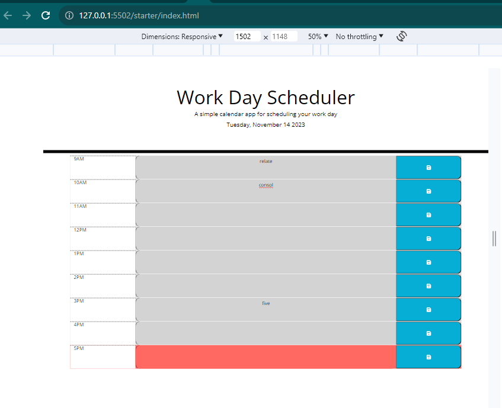

# dailyPlannerApp
This is a simple calendar application that allows a user to save events for each hour of the day 

## Description

A work schedule that enable user plan prioritize their daily plan in other to manage their time spent in a productive way.

## Installation
N/A

## Credit
https://developer.mozilla.org/

https://www.w3schools.com/

https://stackoverflow.com/

https://developer.mozilla.org/en-US/docs/Web/JavaScript

https://day.js.org/docs/en/display/format

https://fontawesome.com/

## Built with
HTML5 CSS JAVASCRIPT(JQUERY)

## License
N/A

## images

